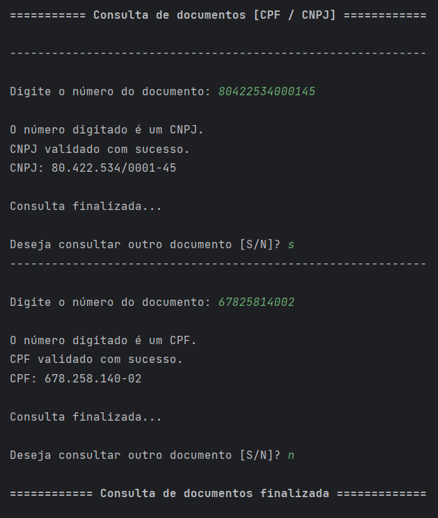

# valida_documento

Construção de um código um Python, com uso de Orientação a Objeto, para consultar se um documento brasileiro (CPF ou CNPJ) é válido ou não.

O código foi contruído em estrutura de classes do Python como descrito:
  Class Documento: 
    Verifica a quantidade de dígitos do documento consultado, determinando se é um CPJ ou um CNPJ.

  Class DocCpf:
    Após a classe Documento constatar que o documento consultado é um CPF, a classe DocCpf verifica se o número é de um CPF válido e faz a sua formatação.

  Class DocCnpj:
    Após a classe Documento constatar que o documento consultado é um CNPJ, a classe DocCnpj verifica se o número é de um CNPJ válido e faz a sua formatação.

Para fazer a validação dos números dos documentos, foi utilizada a biblioteca validate_docbr.

O arquivo documento_consulta.py instacia a classe Documento para iniciar a consulta, podendo realizar inúmeras consultas seguidas.

A construção do código foi atividade do curso PYTHON BRASIL: VALIDAÇÃO DE DADOS NO PADRÃO NACIONAL, da Alura.
